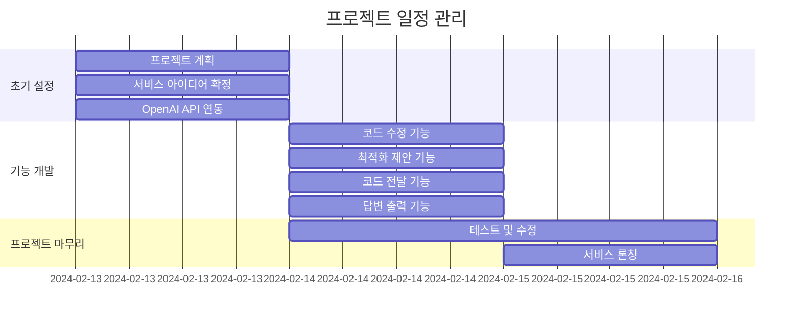

# Pycode-Helper

## 1. 목표와 기능

### 1.1 목표
- **코드 개선:** 사용자의 Python 코드를 분석하고 개선함으로써 코드의 질 상승
- **다양한 풀이 제시:** 다양한 시각으로 문제에 접근
- **인공지능 활용:** OpenAI API를 이용하여 인공지능 기술 활용 경험을 제공

### 1.2 기능
- **코드 수정:** 사용자의 Python 코드 내 오류가 있을경우 수정
- **코드 업그레이드:** 사용자가 입력한 Python 코드를 분석하여 더 효율적이거나 간결한 방식을 제공
- **코드 제안:** 수정된 코드 외에도 다른 방식의 풀이를 제시
- **OpenAI API 사용:** 사용자가 입력한 데이터를 OpenAI API를 이용해 ChatGPT에게 전달하고, 그 결과를 사용자에게 제공


## 2. 개발 환경 및 배포 URL

### 2.1 개발 환경

### 2.2 배포 URL
[jiminkyung.github.io/Pycode-Helper/](https://jiminkyung.github.io/Pycode-Helper/)


## 3. 요구사항 명세와 기능 명세
pass


## 4. 프로젝트 구조와 개발 일정

### 4.1 프로젝트 구조
```
📦Pycode-Helper
 ┣ 📂css
 ┃ ┣ 📜index.css
 ┃ ┗ 📜user.css
 ┣ 📂js
 ┃ ┣ 📜data.js
 ┃ ┗ 📜user.js
 ┣ 📜index.html
 ┣ 📜logo.png
 ┗ 📜user.html
```
### 4.1 개발 일정(WBS)
* 아래 일정표는 머메이드로 작성했습니다.



## 5. 와이어프레임 / UI / BM

### 5.1 와이어프레임
pass

### 5.2 화면 설계
pass


## 6. 데이터베이스 모델링(ERD)
pass


## 7. Architecture
pass


## 8. 메인 기능
pass


## 9. 에러와 에러 해결
pass


## 10. 개발하며 느낀점
pass

