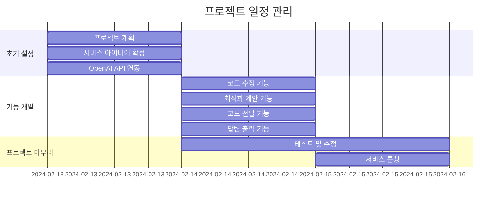
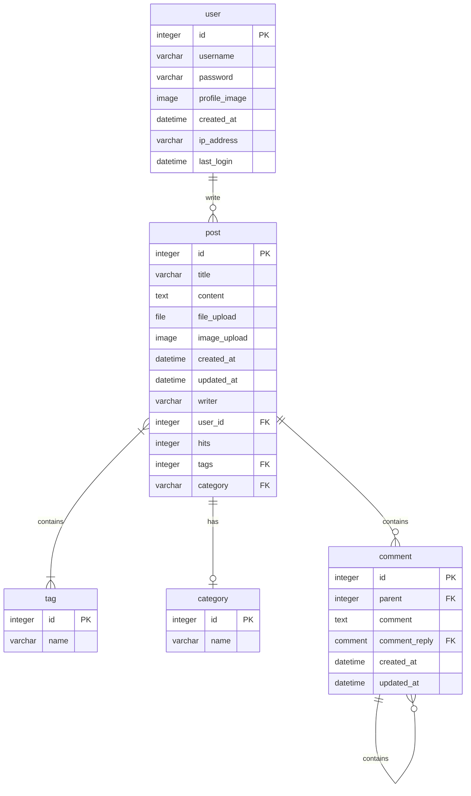
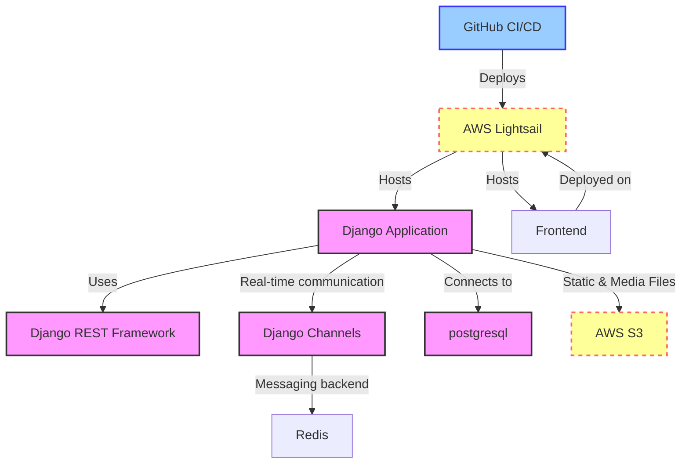
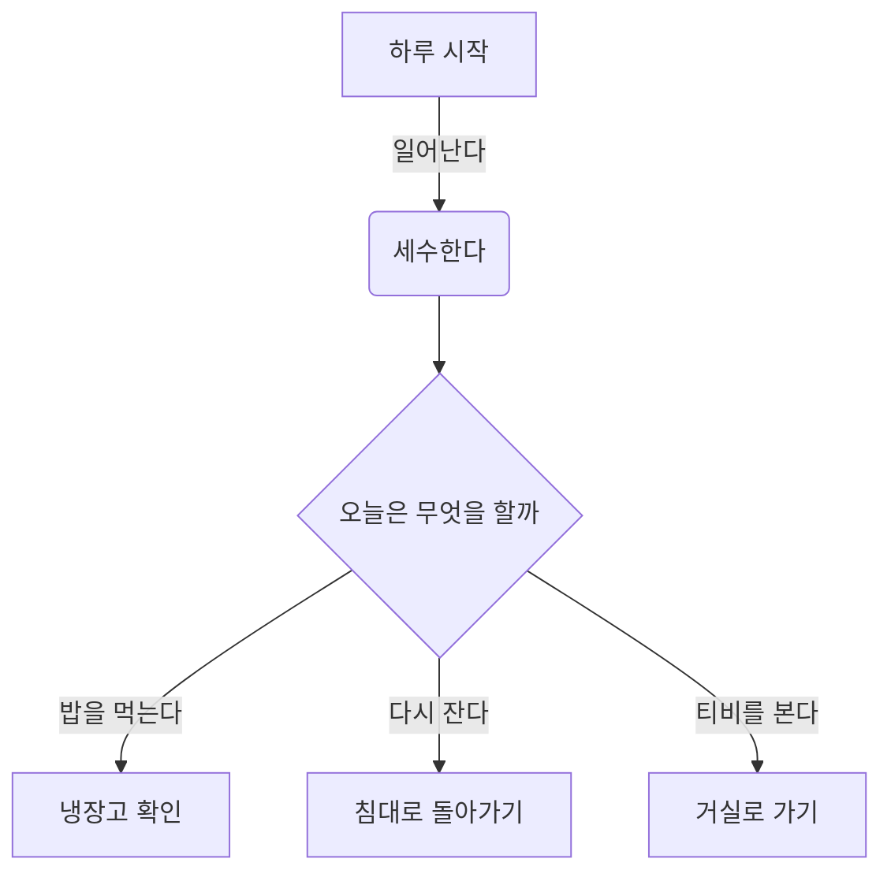
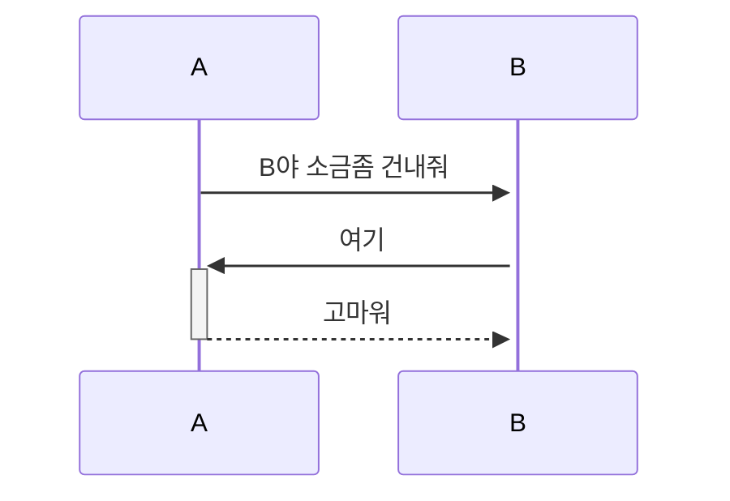
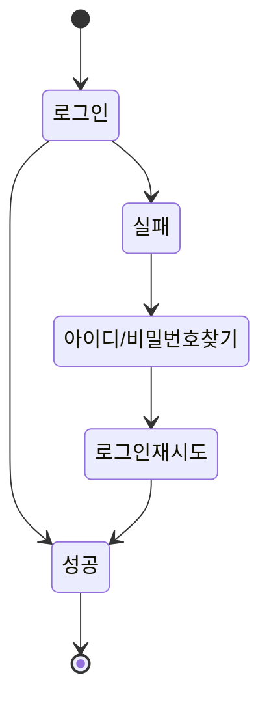

# Pycode-Helper

## 1. 목표와 기능
### 1.1 목표
- **코드 개선:** 사용자의 Python 코드를 분석하고 개선함으로써 코드의 질 상승
- **다양한 풀이 제시:** 다양한 시각으로 문제에 접근
- **인공지능 활용:** OpenAI API를 이용하여 인공지능 기술 활용 경험을 제공

### 1.2 기능
- **코드 수정:** 사용자의 Python 코드 내 오류가 있을경우 수정
- **코드 업그레이드:** 사용자가 입력한 Python 코드를 분석하여 더 효율적이거나 간결한 방식을 제공
- **코드 제안:** 수정된 코드 외에도 다른 방식의 풀이를 제시
- **OpenAI API 사용:** 사용자가 입력한 데이터를 OpenAI API를 이용해 ChatGPT에게 전달하고, 그 결과를 사용자에게 제공

## 2. 개발 환경 및 배포 URL
### 2.1 개발 환경

### 2.2 배포 URL
GitHub Pages 참조

## 3. 요구사항 명세와 기능 명세
pass
- https://www.mindmeister.com/ 등을 사용하여 모델링 및 요구사항 명세를 시각화하면 좋습니다.
- 이미지는 셈플 이미지입니다.

- 머메이드를 이용해 시각화 할 수 있습니다.

## 4. 프로젝트 구조와 개발 일정
### 4.1 프로젝트 구조
📦Pycode-Helper
 ┣ 📜index.css
 ┣ 📜index.html
 ┗ 📜index.js

### 4.1 개발 일정(WBS)
* 아래 일정표는 머메이드로 작성했습니다.

## 5. 와이어프레임 / UI / BM
### 5.1 와이어프레임
- 아래 페이지별 상세 설명, 더 큰 이미지로 하나하나씩 설명 필요

- 와이어 프레임은 디자인을 할 수 있다면 '피그마'를, 디자인을 할 수 없다면 '카카오 오븐'으로 쉽게 만들 수 있습니다.

### 5.2 화면 설계
pass
- 화면은 gif파일로 업로드해주세요.
 
<table>
    <tbody>
        <tr>
            <td>메인</td>
            <td>로그인</td>
        </tr>
        <tr>
            <td>
		
            </td>
            <td>
                
            </td>
        </tr>
        <tr>
            <td>회원가입</td>
            <td>정보수정</td>
        </tr>
        <tr>
            <td>
                
            </td>
            <td>
                
            </td>
        </tr>
        <tr>
            <td>검색</td>
            <td>번역</td>
        </tr>
        <tr>
            <td>
                
            </td>
            <td>
                
            </td>
        </tr>
        <tr>
            <td>선택삭제</td>
            <td>글쓰기</td>
        </tr>
        <tr>
            <td>
	        
            </td>
            <td>
                
            </td>
        </tr>
        <tr>
            <td>글 상세보기</td>
            <td>댓글</td>
        </tr>
        <tr>
            <td>
                
            </td>
            <td>
                
            </td>
        </tr>
    </tbody>
</table>

## 6. 데이터베이스 모델링(ERD)
pass
* 아래 ERD는 머메이드를 사용했습니다.

* 아래 ERD는 [ERDCloud](https://www.erdcloud.com/)를 사용했습니다.

* https://dbdiagram.io/home도 많이 사용합니다.

## 7. Architecture
pass
* 아래 Architecture 설계도는 ChatGPT에게 아키텍처를 설명하고 mermaid로 그려달라 요청한 것입니다.

* 아래 Architecture 설계도는 PPT를 사용했습니다.
  

- PPT로 간단하게 작성하였으나, 아키텍쳐가 커지거나, 상세한 내용이 필요할 경우 [AWS architecture Tool](https://online.visual-paradigm.com/ko/diagrams/features/aws-architecture-diagram-tool/)을 사용하기도 합니다.

## 8. 메인 기능
pass

## 9. 에러와 에러 해결
pass

## 10. 개발하며 느낀점
pass
