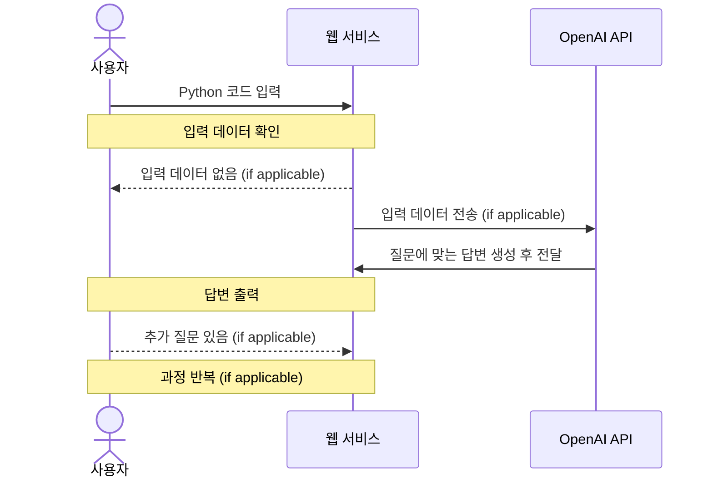
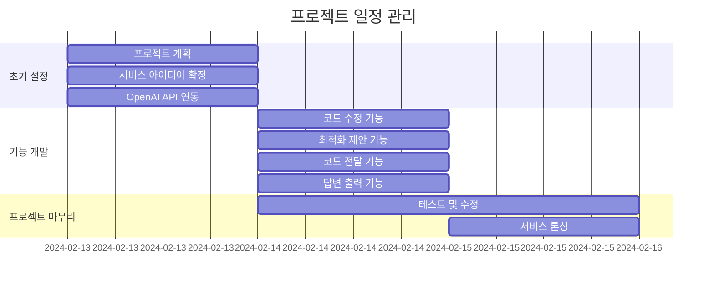
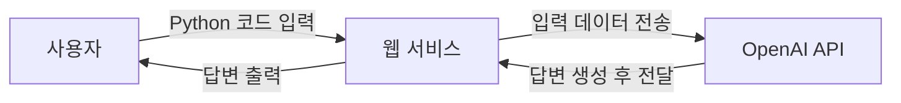

# Pycode-Helper

## 1. 목표와 기능

### 1.1 목표
- **코드 개선:** 사용자의 Python 코드를 분석하고 개선함으로써 코드의 질 상승
- **다양한 풀이 제시:** 다양한 시각으로 문제에 접근
- **인공지능 활용:** OpenAI API를 이용하여 인공지능 기술 활용 경험을 제공

### 1.2 기능
- **코드 수정:** 사용자의 Python 코드 내 오류가 있을경우 수정
- **코드 업그레이드:** 사용자가 입력한 Python 코드를 분석하여 더 효율적이거나 간결한 방식을 제공
- **코드 제안:** 수정된 코드 외에도 다른 방식의 풀이를 제시
- **OpenAI API 사용:** 사용자가 입력한 데이터를 OpenAI API를 이용해 ChatGPT에게 전달하고, 그 결과를 사용자에게 제공


## 2. 개발 환경 및 배포 URL

### 2.1 개발 환경
- 사용 툴
    - VSCode
- 사용 언어
    - HTML
    - CSS
    - JS
- 서비스 배포
    - GitHub Pages

### 2.2 배포 URL
[jiminkyung.github.io/Pycode-Helper/](https://jiminkyung.github.io/Pycode-Helper/)


## 3. 요구사항 명세와 기능 명세



## 4. 프로젝트 구조와 개발 일정

### 4.1 프로젝트 구조
```
📦Pycode-Helper
 ┣ 📂css
 ┃ ┣ 📜index.css
 ┃ ┗ 📜user.css
 ┣ 📂img
 ┃ ┣ 📜git_icon.png
 ┃ ┗ 📜logo.png
 ┣ 📂js
 ┃ ┣ 📜data.js
 ┃ ┗ 📜user.js
 ┣ 📜index.html
 ┗ 📜user.html
```
### 4.1 개발 일정(WBS)
* 아래 일정표는 머메이드로 작성했습니다.



## 5. 와이어프레임 / UI / BM

### 5.1 와이어프레임

Pigma로 제작. 상세 디자인은 링크 참고.
https://www.figma.com/file/DlRtPOel1X6r2R9eJzlrqt/Pycode-Helper?type=design&node-id=13%3A28&mode=design&t=1nMKj2zaEe87V1no-1

### 5.2 화면 설계
**테스트 영상(gif)**


|이미지|이름|설명|
|---|---|---|
||메인 페이지|Pycode-Helper의 첫 화면|
||메인 페이지(펼침)|버튼 밑에 위치한 부분을 클릭하면 Pycode-Helper에 대한 간략한 설명이 펼쳐진다.|
||유저 화면|메인 페이지에서 '시작하기'버튼을 클릭했을 때 나오는 화면. 입력창을 이용해 Python Code에 대한 질문을 할 수 있고, 사용자와 GPT간의 대화가 화면에 출력된다.|


## 7. Architecture



## 9. 에러와 에러 해결
- 타이핑 + 커서 깜빡임 효과
- textarea에 여러줄을 입력 시 입력창은 늘어나지 않고 스크롤바가 생성됨.
    - 스크롤 높이마다 px값을 부여한 값을 textarea 높이값으로 할당
- 학습용 json data의 양이 너무 많아 토큰의 맥시멈을 초과함
    - json data 절반 삭제...


## 10. 개발하며 느낀점
아침이 오기 전

